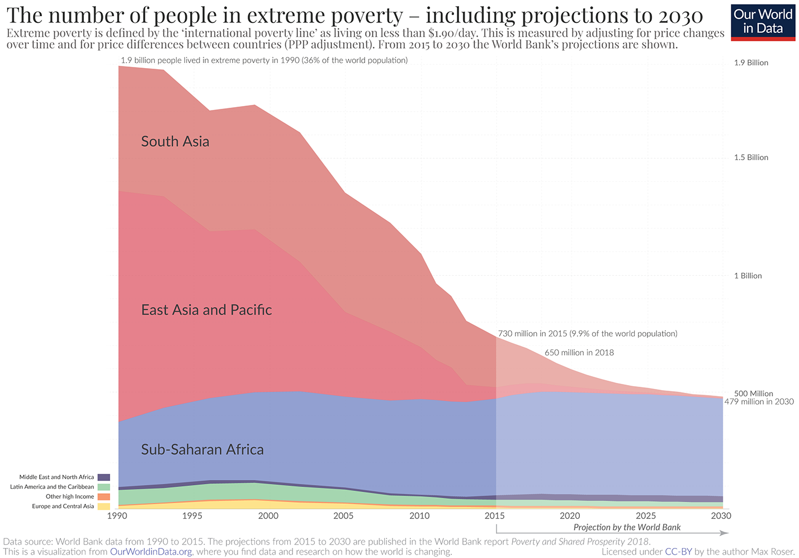
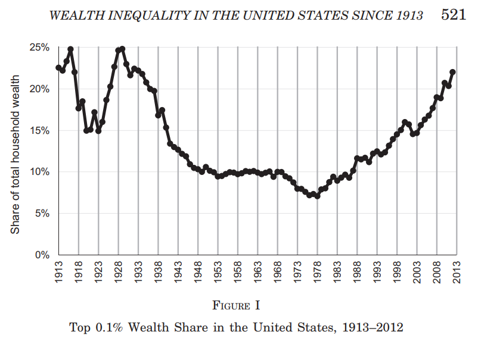
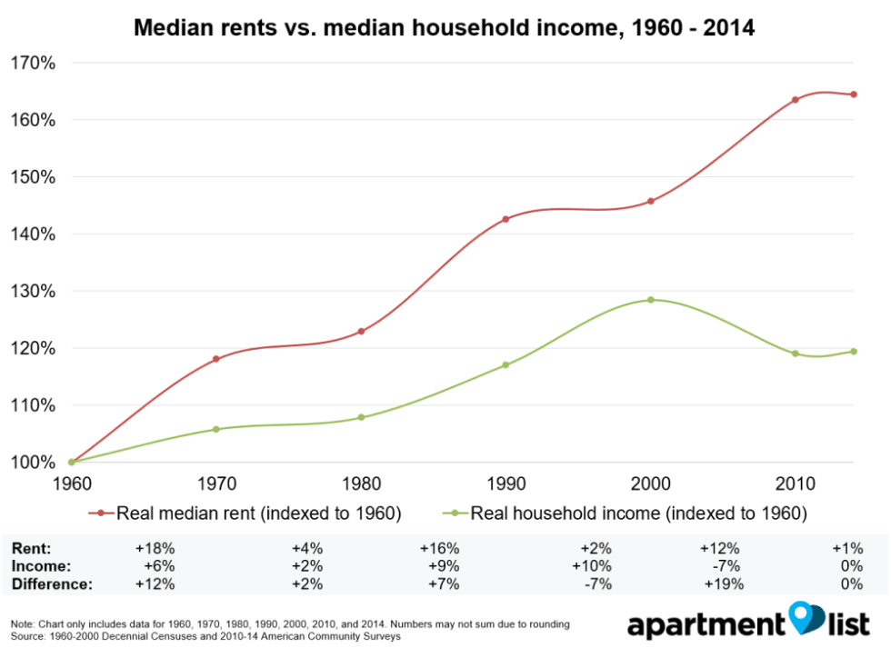

# Book Review: Progress and Poverty

by Lars A. Doucet, 2021

In 1879, a man asked "How come all this new economic development and industrialized technology hasn't eliminated poverty and oppression?" That man was Henry George, his answer came in the form of a book called Progress & Poverty, and this is a review of that book.

Henry George is variously known for leading an early movement that popularized Universal Basic Income, sporting a fancy beard while shouting "The Rent Is Too Damn High!" and [inspiring a popular board game](https://web.archive.org/web/20210111131436/https://landlordsgame.info/) that was shamelessly ripped off and repackaged as Monopoly.

But he didn't just write a book. He also [ran for Mayor of New York city in 1886](https://web.archive.org/web/20200926024934/https://www.city-journal.org/html/1886-men-who-would-be-mayor-12622.html), beating out some rando Republican named "Theodore Roosevelt," but ultimately losing to the favored candidate of Tammany Hall, who saw George's radical economic ideas as a threat to their well-oiled political machine (Andrew Yang take note). He ran again in 1897 but died just 4 days before the election, prompting a national outpouring of mourning. According to Ralph Gabriel's Course of American Democratic Thought, in New York alone 200,000 people came to see his body lying in repose, half of which had to be turned away. For context, that one crowd was roughly the size of [10% of the entire population of New York at the time](https://web.archive.org/web/20210217140046/http://demographia.com/db-nyuza1800.htm).

I'm writing this book review for three reasons:

- George's arguments about land, labor, and capital present a fresh alternative to conventional ideas about "Capitalism" and "Socialism" (and whatever we mean by those on any given day)
- The book has timeless advice for navigating modern crises such as ever-rising rents, homelessness, and the [NIMBY](https://en.wikipedia.org/wiki/NIMBY) vs. [YIMBY](https://en.wikipedia.org/wiki/YIMBY) wars.
- This is a golden opportunity to shamelessly over-use the catchy phrase "By George!"

If I had to summarize the book in a single sentence I would put it this way:

> Poverty and wealth disparity appear to be perversely linked with progress, The Rent is Too Damn High, and it's all because of land.

# The Book as a Book

*Progress and Poverty* is quite readable compared to other 19th-century economic tomes, but has a tendency to repeat itself. This isn't without purpose – George goes to great pains not to be misunderstood; rather than expecting his readers to tease out the meaning of dense prose and spending the next century arguing with each other about what he "really meant", he goes on for pages and pages beating a single concept to absolute death, just to be sure.

As a 19th century treatise of *[Political Economy](https://en.wikipedia.org/wiki/Political_economy)*, the book doesn't match what a modern reader might expect from a book on *[Economics](https://en.wikipedia.org/wiki/Economics)* because it's not packed to the gills with charts, graphs, tables, and statistics (though it does provide a good number of citations and figures). Nevertheless his argument was compelling enough to spawn an entire economic school of thought known variously as [Georgism or Geoism](https://en.wikipedia.org/wiki/Georgism) that persists to this day.

Nowadays Georgism gets slapped with the "heterodox" label, but it's still relevant enough to get the likes of [Paul Krugman](https://web.archive.org/web/20201108115738/https://psmag.com/news/this-land-is-your-land-3392) and [Milton Friedman](https://web.archive.org/web/20200723204745/https://econjwatch.org/File+download/66/2005-04-foldvary-tyranny-statquo.pdf?mimetype=pdf) to grudgingly agree to key points, and [Friedrich Hayek](https://onlinelibrary.wiley.com/doi/epdf/10.1111/1536-7150.00016) is alleged to have been inspired by it to pursue economics in the first place. Marx, on the other hand, [wasn't a fan](https://web.archive.org/web/20201203222039/https://www.marxists.org/archive/marx/works/1881/letters/81_06_20.htm), seeing it as a last-ditch attempt "to save capitalist domination and indeed to establish it afresh on an even wider basis than its present one... [George] also has the repulsive presumption and arrogance which is displayed by all panacea-mongers without exception." I guess you can't please everyone.

George spends the first few books of Volume I establishing terms and methodically tearing apart the prevailing economic theories of his day before presenting his own alternative theories about how the "three factors of production" – land, labor, and capital – relate to each other in the "laws of distribution." He then explains why the existing system causes poverty to advance alongside progress, and why we see industrial depressions. Then, he identifies the root cause of the problem (land ownership and speculative rent) and presents his solution (the Land Value Tax) in Volume II. He spends the entire second volume explaining why it is moral and just, how it should be applied, and why it will solve all of our problems.

For the sake of the reader's attention span, I'll just cover the chapters that constitute the core of George's philosophy. For sections I gloss over, I'll include a brief summary of the main point followed by a jump link to an appendix at the end of the article for those who want more detail. All block quotes are from Progress & Poverty unless otherwise marked.

Special thanks to my friend Adam Perry for helping me edit this piece, as well as to Nate Blair and blogger [BlueRepublik](https://bluerepublik.wordpress.com/) (who have actual degrees in this sort of thing) for fact checking and answering my technical questions in the vain pursuit of not embarrassing myself.

Alright, let's dive in.

# 0. The Problem

George opens by observing an unkept promise made by Industrialists:

> it was expected, that labor-saving inventions would lighten the toil and improve the condition of the laborer.

Industrialization should have freed humankind from drudgery and want. And yet George instead sees:

> complaints of industrial depression; of labor condemned to involuntary idleness; of capital massed and wasting; of pecuniary distress among business men; of want and suffering and anxiety among the working class

If we finally have the necessary material conditions and technology for utopia, why this suffering, waste, and inefficiency?

And what's the deal with industrial depressions? How can there be periods where laborers desperately want to work but can't find employment at the very same time capital sits around in useless piles, begging to be put to productive use?

Contra popular explanations at the time, George argues it "can hardly be accounted for by local causes" such as military expenditures, tariffs, type of government, dense vs. sparse populations, or paper money vs. hard currency. This is because he sees the same basic problem everywhere no matter how different the countries themselves are. Behind all of these troubles George says there must lie a common cause.

Pulling no punches, the man lays the blame at the feet of *progress itself*:

> that poverty and all its concomitants show themselves in communities just as they develop into the conditions toward which material progress tends - proves that the social difficulties existing wherever a certain stage of progress has been reached, do not arise from local circumstances, but are, in some way or another, engendered by progress itself

This is a pretty bold claim: namely, that the resilience of poverty, oppression, and inequality in the face of advancing economic development is not some embarrassing accident we'll eventually get around to fixing, it's an inescapable consequence of our socioeconomic system.

---

## A Brief Interlude from the Future

It's been over 140 years since he wrote the book, so let's hop in my time machine and see how much of George's complaint is still relevant.

Back then, the United States was still in the throes of the [Long Depression](https://web.archive.org/web/20201201000238/https://www.armstrongeconomics.com/history/americas-economic-history/the-long-depression-the-first-great-depression/), which according to the shortest estimate lasted from 1873 to 1879.

Below is a graph ([source](https://web.archive.org/web/20210216220345/https://www.nber.org/research/business-cycle-dating)) of the boom-bust business cycle going back to the 1870's - clearly, recessions were much more frequent and severe in George's time than they are today. The late 1800's were wracked with so many panics and crises in quick succession that some historians count the Long Depression as lasting for a full 23 years from 1873 to 1896!

After the Great Depression in the 1930's, we see a sharp decrease in the duration and frequency of recessions. They're still with us now (and the one we're currently in is the worst since the Great Depression), but you'd still rather be living in 2021 than 1879.

So, have we solved the problem? Is George's complaint obsolete?

I mean, this graph of GDP per capita from Stephen Pinker's Enlightenment Now makes it look like in many ways things are getting better:

And heck, [extreme poverty has been going down everywhere](https://ourworldindata.org/extreme-poverty):

But this can't be the entire picture, or nobody would be complaining about poverty and inequality.

Here - this graph ([source](https://web.archive.org/web/20210112150023/https://howmuch.net/articles/price-changes-in-usa-in-past-20-years)), shows that as consumer goods have gotten cheaper in the United States, health care, higher education, child care, etc., have skyrocketed in price, as examined in great detail in the article [Considerations on Cost Disease](https://slatestarcodex.com/2017/02/09/considerations-on-cost-disease/).

And what about Inequality? In the USA it seems to have reverted to levels not seen since the Great Depression, and even when it was at its lowest in 1978, the top 0.1% (not even the top 1%!) still enjoyed a massively disproportionate share of Wealth ([source](https://web.archive.org/web/20210202081558/http://gabriel-zucman.eu/files/SaezZucman2016QJE.pdf)):

And of course, The Rent Is Too Damn High:

([source](https://web.archive.org/web/20210216184021/https://www.apartmentlist.com/research/rent-growth-since-1960)):

([source](https://web.archive.org/web/20210208185441/https://observationsandnotes.blogspot.com/2011/06/us-housing-prices-since-1900.html)):

Although 2021 seems better than 1879 in absolute material terms, George's complaint still rings true: healthcare and higher education are increasingly unaffordable, inequality is as bad as it ever was, and The Rent Is Too Damn High.

And even if all of these measures had improved as well, we still have to contend with a fundamental complaint: how can human civilization have piled up an amount of wealth best described as absolutely *[banana pants insane](https://web.archive.org/web/20210208132052/https://www.credit-suisse.com/media/../assets/corporate/docs/about-us/research/publications/global-wealth-report-2020-en.pdf)*, and yetstill have poverty, oppression and cyclical recessions? Yes, greed, evil, and human nature will always be with us, but isn't it weird that we haven't eliminated these economic problems the same way we've eliminated Smallpox, Scurvy, and having to write your scathing polemics about Thomas Jefferson by candlelight with a goose feather?

---

Giving the mic back to George, he closes the chapter with this haunting quote, first written 142 years ago:

> If there is less deep poverty in San Fran Francisco than in New York, is it not because San Francisco is yet behind new York in all that both cities are striving for? When San Francisco reaches the point where New York now is, who can doubt that there will also be ragged and barefooted children on her streets?

I'll just leave this here:

[Number of Homeless Children in U.S. At All-Time High; California Among Worst States.](https://web.archive.org/web/20160324104539/https://sanfrancisco.cbslocal.com/2014/11/17/number-of-homeless-children-in-u-s-at-all-time-high-california-among-worst-states/)